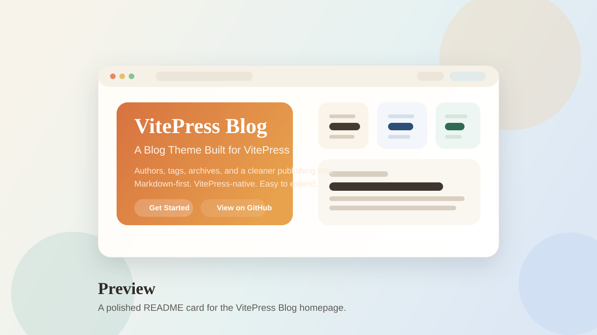

# VitePress Blog Theme

[](https://www.npmjs.com/package/@chunge16/vitepress-blogs-theme)
[](https://github.com/chunge16/vitepress-blogs-theme/blob/main/LICENSE)

A VitePress theme that turns a documentation site into a polished blog, without giving up the simplicity of Markdown or the flexibility of the default VitePress experience.



## Why This Theme

VitePress is excellent for content-driven sites, but building a real blog on top of it still takes glue work. This theme packages the common pieces you usually end up rebuilding yourself, so you can start with a clean blog structure and keep customizing as your site grows.

It is a good fit if you want to:

- publish blog posts with Markdown
- organize content by authors, tags, categories, and archives
- keep the VitePress developer experience
- extend the site with your own Vue components and theme logic

## Features

- Blog index, post pages, author pages, tag pages, and archive pages
- Markdown-first workflow with frontmatter-driven content
- Built on top of the default VitePress theme
- Tailwind CSS integration for easier styling
- Optional Giscus comments support
- Setup wizard to scaffold the initial blog structure

## Quick Start

### 1. Install

```sh
pnpm add -D vitepress @chunge16/vitepress-blogs-theme tailwindcss @tailwindcss/vite
```

```sh
npm install -D vitepress @chunge16/vitepress-blogs-theme tailwindcss @tailwindcss/vite
```

```sh
yarn add -D vitepress @chunge16/vitepress-blogs-theme tailwindcss @tailwindcss/vite
```

### 2. Scaffold the site

```sh
pnpm vitepress-blog-init
```

```sh
npx vitepress-blog-init
```

```sh
yarn vitepress-blog-init
```

### 3. Start development

```sh
pnpm run docs:dev
```

## Documentation

- Docs site: [chunge16.github.io/vitepress-blogs-theme](https://chunge16.github.io/vitepress-blogs-theme/)
- Getting started: [guide/getting-started](https://chunge16.github.io/vitepress-blogs-theme/guide/getting-started)
- Theme config: [reference/config](https://chunge16.github.io/vitepress-blogs-theme/reference/config)

## What Gets Generated

The setup wizard creates the essential structure for a VitePress-powered blog:

```txt
docs/
  .vitepress/
    config.js
    theme/
      index.js
  blog/
    authors/
    posts/
    archives.md
    index.md
    tags.md
```

From there, you can keep the default setup or continue extending it like any other VitePress theme.

## Customization

This theme extends the default VitePress theme instead of replacing the VitePress workflow. That means you can still:

- add custom Vue components
- register `enhanceApp` logic
- override styles
- evolve the site into a docs-and-blog hybrid

## Credits

Inspired by ideas and implementations from:

- [VitePress Blog Starter](https://github.com/sfxcode/vitepress-blog-starter)
- [Vue Blog](https://github.com/vuejs/blog)
- [clark-cui/vitepress-blog-zaun](https://github.com/clark-cui/vitepress-blog-zaun/)
- [Charles7c/charles7c.github.io](https://github.com/Charles7c/charles7c.github.io/)
- [jcamp-code/vitepress-blog-theme](https://github.com/jcamp-code/vitepress-blog-theme)

Demo blog content is created by [vitepressblog](https://vitepressblog.dev).

## Changelog

Release notes are available in [CHANGELOG.md](https://github.com/chunge16/vitepress-blogs-theme/blob/main/CHANGELOG.md).

## License

[MIT](https://github.com/chunge16/vitepress-blogs-theme/blob/main/LICENSE)

Copyright (c) 2023-present, chunge
